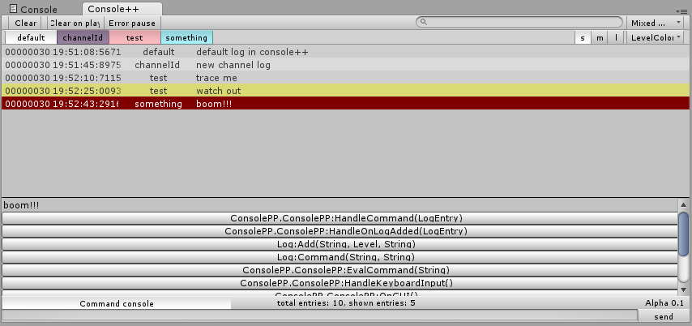

Console++
========



#about
Console++ is a Unity3D editor console which includes more features then the default unity console.

##features
- channels
- colors
- complete callstack jumpto
- use of params in logs *(using string.Format)*
- timestamp
- frame number
- more levels
  - Trace
  - Debug
  - Info
  - Warning
  - Error
- save to hmtl *(wip)*

#install
Just copy the ConsolePP folder in your project. After compilation you will be able to open the console++ under "Window/Console++".

#usage
##logging
You can still use 
```C#
Debug.Log("");
Debug.LogWarning("");
Debug.LogError("");
```
these logs will be added to the default channel with the info, warning or error levels. 

Next to that you can now use
```C#
Log.Trace(string id, string msg);
Log.Debug(string id, string msg);
Log.Info(string id, string msg);
Log.Warning(string id, string msg);
Log.Error(string id, string msg);
```
Here the id is the channel and the msg the normal message.

##commands (wip)
Inside the console there is a simple command line which supports a small number off command. These command can also be send using the command level (`Log.Command(string id, string msg);`). Commands which apply on a channel are executed on the given channel or the default if none is given. Other commands apply to the global level. A command channel can be defined by `channelId:command params`.

- channel commands
  - show
  - hide
  - toggle
  - color *r* *g* *b* *a*
  - log *lvl* *msg*
  - clear (not implemented yet)
- global commands
  - deselect
  - clearall
  - clearchannels
  - save
  - ulog *msg*


